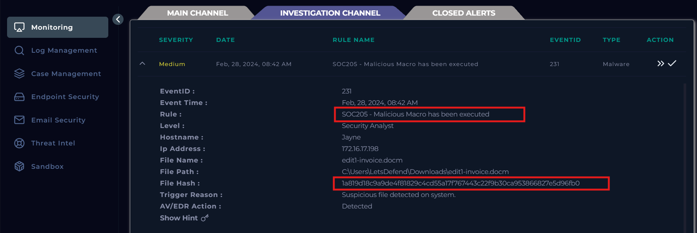

# SOC205 - Malicious Macro has been executed

## Information

Event ID: 231

Rule: SOC205 - Malicious Macro has been executed

Time: 28/02/2024, 08:42 AM

**File Path :** C:\Users\LetsDefend\Downloads\edit1-invoice.docm

**File Hash :** 1a819d18c9a9de4f81829c4cd55a17f767443c22f9b30ca953866827e5d96fb0

## Alert

Cảnh báo này thông báo về việc tìm thấy 1 file đáng ngờ được chạy trong hệ thống nghi là malware, đầu tiên chúng ta cần phải ngăn chặn sự lây lan và ảnh hưởng của mã độc này trong hệ thống mạng bằng cách cô lập các thiết bị đang thực thi file này.

Đầu tiên thử tìm kiếm trong Log management xem thử các hành động nào liên quan đến file  “edit1-invoice.docm” thì thấy chỉ có 1 host mang IP là 172.16.17.198 thực thi file đáng ngờ này thôi, tiến hành cô lập thông qua Endpoint Security.

## Detect

Bắt đầu điều tra thì thấy Jayne (thiết bị chạy mã độc) được gửi 1 email từ 1 admin của bộ phận cybercommunity đính kèm file.zip (có thể đây là một cuộc test được lên plan của bộ phận redteam).

Log tiếp theo thì thấy người dùng này đã tải file .zip này về

Sau khi tải và giải nén người dùng này còn bấm mở file docm này và enable cho macro thực thi

Command Line: 'C:\Program Files\Microsoft Office\Office14\WINWORD.EXE' /n 'C:\Users\admin\AppData\Local\Temp\edit1-invoice.docm’

tạo 1 file **“edit1-invoice.docm”** ở đường dẫn này **“C:\Users\admin\AppData\Local\Temp”** bởi WINWORD.EXE (tiến trình microsoft word), macro là 

Khi vào Endpoint security xem log thì không được hiển thị fail retrival phải dùng Log Management để tìm và xem Log, với kịch bản về mã độc thì bước tiếp theo chúng ta cần phải kiểm tra là liệu mã độc này có kết nối về kênh C2 không bằng cách query các log của IP **“172.16.17.198”** xem có kết nối ra ngoài internet bằng các protocol như DNS, HTTP,… hay không? Sau khi filter thì có 1 log khả nghi dùng DNS để query ra ngoài URL: “[WWW.GREYHATHACKER.NET](http://www.greyhathacker.net/)” bằng powershell vào lúc 08:42 AM tức là ngay khi chạy file .docm .

Kiểm tra xem liệu Firewall có phát hiện và ngăn chặn được hành động kết nối này không (tìm IP của URL đó)? thì kết quả là lỗi mất Log :((

Lọc log bằng URL của kênh C2 thử xem malware có gửi yêu cầu đến để nhận lệnh không. Thì thấy 1 log là tải “messbox.exe” từ web về.

Thông qua tường lửa nhưng gặp mã 404.

Kẻ tấn công thực hiện lại 1 script khác

Khi tìm kiếm ở Email Security bằng email của kẻ tấn công thì thấy đây là 1 email với vector tấn công là phising đính kèm mã độc sử dụng office macro để thực thi powershell script và kết nối C2 trong file hóa đơn. Không thấy email nào khác về việc kiểm thử bảo mật.

Đưa file .docm vào môi trường ảo kali và dùng tool olevba chuyên dùng để phân tích tĩnh các file office chứa macro, sau khi phân tích file **“edit1-invoice.docm”** thì thấy có rất nhiều hàm supspicious nhầm kết nối C2 và thực thi các file .exe

Họ dùng tiến trình cmd để gọi đến powershell để tải và thực thi các file thực thi qua kênh C2 của họ

## Start Playbook

- Đây là mã độc kết nối kênh C2

- Không được ngăn chặn và cách ly, kết quả là có 1 lệnh kết nối DNS ra ngoài internet.

- Được VirusTotal đánh giá là malicious file thông qua mã hash: 1a819d18c9a9de4f81829c4cd55a17f767443c22f9b30ca953866827e5d96fb0

- Có kết nối kênh C2 tới URL: “[http://www.greyhathacker.net/](http://www.greyhathacker.net/)” bằng giao thức DNS

- Đã cách ly máy nạn nhân

## Close Alert

## MITRE  ATT&CK

## Artifacts

Field

Hash

Attacker IP

Sender Mail Address

URL

Malicious File

Exe

Value

1a819d18c9a9de4f81829c4cd55a17f767443c22f9b30ca953866827e5d96fb0

92.204.221.16

jake.admin@cybercommunity.info

hxxp://www.greyhathacker.net/tools/messbox.exe

edit1-invoice.docm

mess.exe | messbox.exe